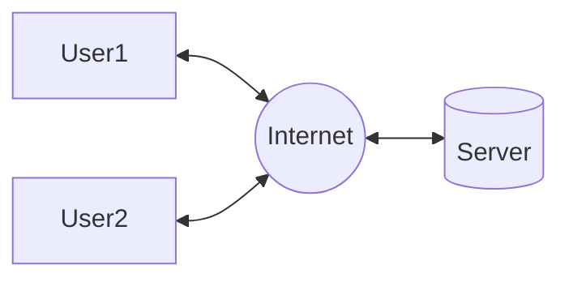

# Computer Networks - Classification

### Classification on the basis of Geographical Area :

1. **Personal Area Network (PAN)** : connects personal devices within a short range (under 10 meters), using Bluetooth, Infrared, etc.

2. **Local Area Network (LAN)** : connects devices within a single building, home, or office up to a few kilometers.

3. **Campus Area Network (CAN)** : connects multiple LANs within a specific area such as university or corporate organizations.

4. **Metropolitan Area Network (MAN)** : spans across an entire city (5 to 50 km). examples may include TV network, or local ISP.

5. **Wide Area Network (WAN)** : covers very large distances across states, countries, and even continents. The Internet is the best example of WAN.

---

### Classification on the Basis of Network Architecture

there are two types of Network Architectures :

 

1. **Client-Server Architecture** : a centralized system where a central server fulfills the requests made by clients (end users). 

> the client-server architecture can be further divided into :
> 
> - **2-Tier Architecture** : consists of two layers - client layer & server layer. the client directly communicates with server. the server handle both processing and data storage. this architecture may be applied in small projects. but it is not suitable in terms of scalability and is less secure.
> 
> - **3-Tier Architecture** : this divides the system into three distinct layers - presentation layer (client), application layer (business logic), and data layer (database server). the client communicates with application server instead of directly communicating with database server. more secure and flexible.
> 
> **Note** : Socket programming is implemented for Client-Server communication

 

2. **Peer-To-Peer Architecture** : it is a decentralized system. No central server, each node can act as both server and client. its a direct sharing between devices. examples : Torrent, Napster, Blockchain, etc.

---

### Classification on the basis of Transmission Media

1. **Broadcast Networks** : data transmitted by one node is received by all other nodes. each data packet consists of destination address, only intended device processes it. follows 1-to-many model.

2. **Point-to-Point Network** : uses dedicated link between communication devices. follows 1-to-1 model. 

---

### Classification on the basis of Ownership & Access Control

1. **Private Network** : owned and managed by an individual or organization. access is restricted to authorized users only. requires authentications such as username, passwords, VPNs, or access tokens.

2.  **Public Network** : owned by service providers or government authorities. accessible to general public. requires little to no authorization. 

3. **Hybrid Network** : combination of both private and public network. example : a corporate network connected to internet.

---

**Internetwork** is a collection of two or more independent networks connected together to function as single logical network. The Internet is also a large internetwork.

1. **Intranet** : an intranet is a private network used within an organization.

2. **Extranet** : extension of intranet, allows limited to external users using VPNs, etc.

