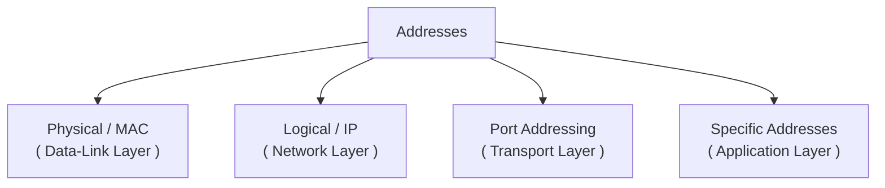

**Addressing** in computer networks is the process of assigning *Unique Identifiers (Addresses)* to devices, nodes, or applications so that they find and recognize each other for communication. addressing is done for :

- **Unique Identification** : ensures that each machine is uniquely identified in a network.

- **Data routing** : routers use addresses to perform routing.

- **Process Separation** : port addresses make sure that data reaches intended application or process. 

---

1. **Physical Address** : is a unique identifier that works within a local network. 
- Implemented by MAC (Media Access Control) address.

- MAC is a unique hardware identifier which is hard-coded by manufacturer and it is never changed. The original MAC is always same but it can be spoofed and randomized. Operating systems can also generate a virtual MAC address for softwares, virtual machines, or privacy features.

- Length of MAC address is 48 bits (6 bytes), and is represented as 12 hexadecimal digits formatted in 6 pairs and separated using hyphens or colons. example - `00:1A:2B:3C:4D:5E` or `00-1A-2B-3C-4D-5E`.

- MAC is stored inside ROM of interface cards like NIC (Network Interface Card/Controller), Bluetooth interface, etc. That means a device can be associated with multiple MAC addresses because the MAC address is not assigned to a device instead the interfaces has them. if your system has Ethernet NIC, WiFi NIC, and a Bluetooth module, all three interfaces will have their own MAC addresses, so your device will have 3 MAC or even more in case your OS generates virtual addresses.

- The primary purpose is to uniquely identify devices within same local network.

- Used at Data-Link Layer (L2) by devices like switches and other L2 devices.

---

2. **Logical Address** : is a unique identifier that identifies devices across different networks connected to each other. if the networks are logically same they can directly use this addresses but for different logical networks or subnets - routers can make them communicate.
- Implemented by IP (Internet Protocol) address. which has 2 versions - IPv4 & IPv6.

- IPv4 uses 32 bits (4 bytes), and is written as 4 octets separated by period example `192.168.10.1`. these are mostly used. (detailed study in network layer).

- IPv6 uses 128 bits, and is written as 8 groups of 4 hexadecimal digits separated by colons. example `2001:0db8:85a3:0000:0000:8a2e:0370:7334`. 16 bits x 8 blocks.

- These addresses are stored in RAM of computer. and can be reassigned - these are not hard-coded. 

- The primary purpose is to uniquely identify device across different networks.

- Used at Network Layer (L3) and is used primarily by routers and L3 devices.

---

3. **Port Address** : also known as service point addressing, as they are used to uniquely identify applications or processes on a host. they ensure process-to-process delivery, i.e. only intended software gets to read the data.
- Implemented using port numbers which are 16 bits numbers.

- Used at Transport layer (L4).

- Common Ports : `HTTP (80)`, `HTTPS (443)`, `FTP (21)`, `SSH (22)`,`DNS (53)`,`SMTP (25)`,`POP3 (110)`,`IMAP (143)`. (detailed discussion in transport layer).

---

4. Specific Addresses : addresses like email `user1@sample.com`, URL (Uniform Resource Locator) `www.google.com`, etc.

---

> NOTE : Both MAC and IP can uniquely identify devices. then why do we use both ? - because if only MAC used, the internet will become too slow as routers will need to store a giant list of global MAC addresses. unlike this IP has features like geographical addresses and private IPs that makes routing easy. but if only IP is used - there will be no permanent identity. that is why both are used in modern networking.

