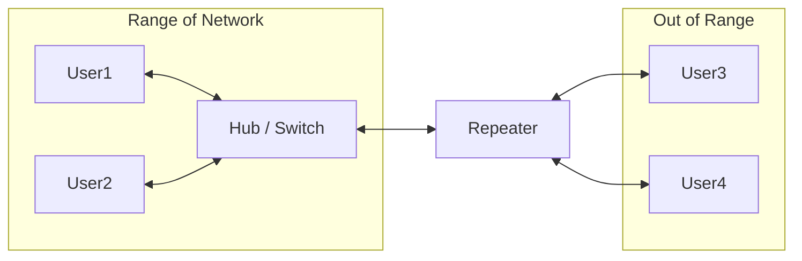
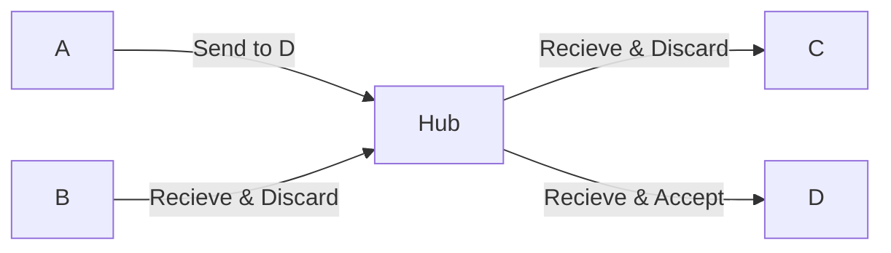
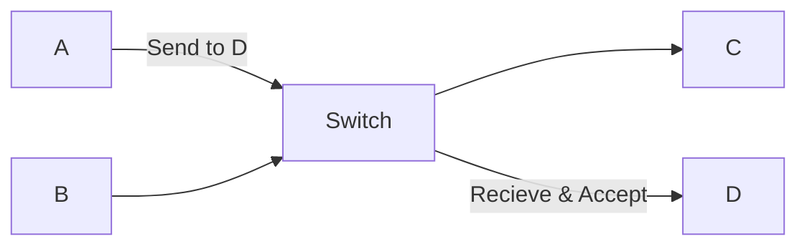
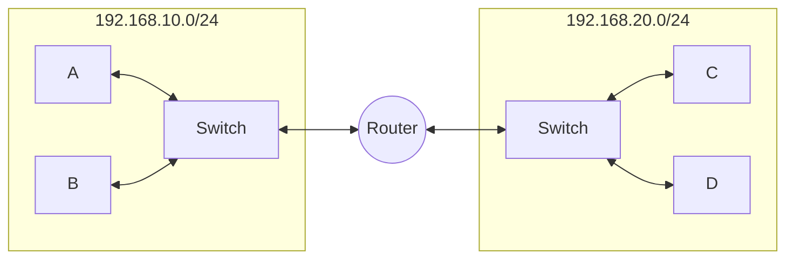
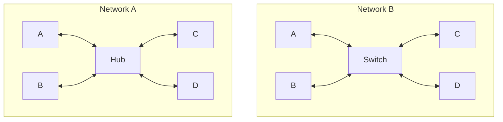
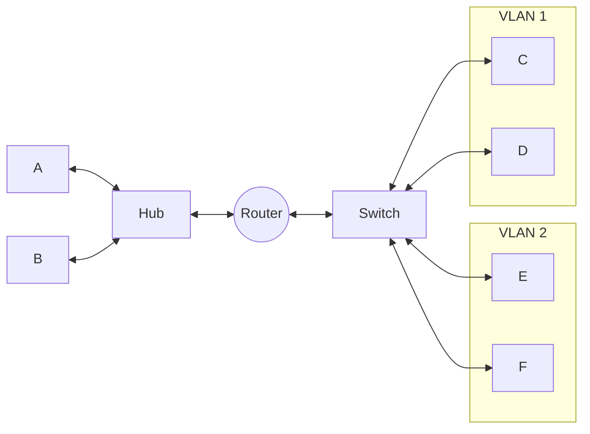

### Layer 1 ( Physical layer )

Devices at Layer 1 primarily deals with raw electrical or optical signals. These are called dumb devices as they do not understand any type of addresses.

- **Repeater** : it regenerates weakened signals. it receives weak signal - regenerates / amplifies it, to extend the range of network. It solves Attenuation in network.



- **Hub** : it is essentially a multi-port repeater. It connects multiple devices within local network. It receives data from a node and broadcast to all. That means if A wants to send data to B. the hub will send the data to all nodes, but only B will check header and receives it. Other nodes will discard the packet if it does not belong to them.



- **Modem** (Modulator-Demodulator) : it converts Digital signals to Analog signals (Modulation) and Analog signals back to Digital signals (Demodulation).

---

### Layer 2 ( Data-Link Layer )

Devices at Layer 2 primarily deals with communication within same network but using MAC addresses (physical), to reduce collisions, and better security.

- **Bridge** : connects two or more LANs and forwards frames based on MAC Addresses. But the network ID of those LANs must be same. if not - then router is used. Bridges are replaced by switches.

- **Switch** : is essential a multi-port bridge. it connects devices within same network (i.e. same network ID). it is advanced version of Hub, as it is intelligent, it maintains a MAC Address table and forwards data only to intended device. Unlike Hub - it does not broadcasts the data. 
  
  - Unmanaged Switches : plug-and-play, usually used in personal use-cases.
  
  - Managed Switches : manually configured and managed by organization.



- **Access Point** : it extends a wired network to a wireless network (WLAN). it only provides wireless signals and do not route.

---

> **NIC (Network Interface Card / Controller)** : it acts as a interface between our devices and network. i.e. it is responsible for connecting our device to the network. It operates on both L1 & L2. at layer 1, it handles signals, and at layer 2, it uses MAC for forwarding (MAC is stored in ROM of NIC).

---

### Layer 3 ( Network Layer )

Devices at this layer primarily deals with communication between different networks with different network IDs. device at this layer uses IP addresses to uniquely identify.

- **Router** : it connects two or more different IP networks, it maintains a routing table that helps routing a packet from one network to another. it stops the broadcast traffic, that means that some data being broadcasted in one network does not reach another network. Router allows two networks to communicate but without making them one - they are still two separate networks which are able to communicate to each other.



- **Brouters** :  Bridge + Router , operates at both L2 & L3

- **Layer 3 Switches** : combine L2 Switching & L3 Routing, It can perform both Switch & Router functions and work on both L2 & L3. it can route between VLANs using SVI (Switched Virtual Interfaces). these use Hard-Based routing, while routers do Software-Based routing.

---

### Layer 4 - 7

- **Gateways** : connects two dissimilar networks using different protocols. it can convert protocols, data format and even architecture. these can be of different type like Application gateway, internet Gateway, etc. an Internet Gateway translates private LAN to public internet requests. although mostly studied at application layer, a gateway can operate at different layers depending upon its implementation.

- **Firewalls** : are used for network security, they control incoming and outgoing traffic based on security rules. Firewalls does packet filtering by looking at header of packet. Firewall can be software-based or hardware-based. 

---

### Network devices - Domain

a **Domain** here refers to a group of devices that shares some particular networking behavior. There are two major types :

<br>

1. **Collision Domain** : is a network segment where devices share same medium, in which simultaneous transmissions can potentially experience collision - two or more signals interrupting each other due to same medium.



- **Network A** : a hub repeats incoming signals to other ports. i.e. the collision domain is the complete network. No. of Collision Domains = 1. that means all 4 computers are in same collision domain.

- **Network B** : as switch does not broadcast, each switch port is a separate collision domain. No. of collision domains = 4. that means a switch breaks collision domains. same is the case with router.

<br>

2. **Broadcast Domain** : is a group of devices that can receive a layer 2 broadcast sent by device within same domain.
- **Hub** : in case of hub - the broadcast domain is 1 because within that network every receives the broadcast trafic

- **Switch** : does not break the broadcast domain, here also all the devices receives broadcast traffic. (Number of broadcast domains = 1)

- **Router** : this now separates the broadcast domain, as broadcast from network A cannot go to network B connected by a router. a router blocks the broadcast traffic from one network to another.

- **VLAN** : each VLAN is also a separate broadcast domain.

<br>

to summarize we can say :

- Each Hub -> 1 Collision Domain

- Each Switch Port -> 1 Collision Domain

- Each Router port -> 1 Collision Domain

- Each Hub -> 1 Broadcast Domain

- Each Switch -> 1 Broadcast Domain

- Each Router Port -> 1 Broadcast Domain

- Each VLAN -> 1 Broadcast Domain

- Full-Duplex Ethernets normally has NO Collisions.

- Broadcast is a Layer 2 concept that is why breaks at layer 3.

**Note** : same will be the case if same layer device is replaced. like switch and bridge will behave same, and similar for each layer device.

<br>



> Considering the following diagram, lets count number of collision and broadcast domains.
> 
> ```
> A + B + Hub + router = 1
> Hub <--> Router = 1
> Router <--> Switch = 1
> Switch <--> C = 1
> Switch <--> D = 1
> Switch <--> E = 1
> Switch <--> F = 1
> --------------------------------
> Number of Collision Domains = 6
> ```
> 
> ``` 
> A + B + Hub = 1
> Switch <--> VLAN 1 = 1
> Switch <--> VLAN 2 = 1
> --------------------------------
> Number of Broadcast Domains = 3
> ```


